# Stock Analysis

---

## Introduction

The objective of this study is to move beyond simple price action and evaluate stocks based on:

- Market Sensitivity (Beta): Measuring how closely individual stocks correlate with the broader sectoral index.
- Performance (Alpha): Calculating the excess returns generated over the benchmark.
- Risk-Adjusted Returns (Sharpe Ratio): Determining if the returns justify the volatility.
- Momentum (RSI): Identifying overbought and oversold conditions to gauge potential trend reversals.

By the end of this analysis, we identify which asset has historically provided the most efficient growth for investors.

---

## Environment setup

### Creating environment
```Bash
mamba create -n <my_project_name> python=3.11 -y
mamba activate <project_name>
```
### Installing useful libraries
```Bash
mamba install yfinance
```
- Also attached environment yaml file for recreating the environment.

---

## [1 Eda & Cleaning](1_EDA_Cleaning.ipynb)
- Downloading 10 year ticker data.
- `auto_adjust=True` so that corporate actions like dividends, stock splits, etc. are taken care of at the source.
- Cleaning nan and 0 values as they are non trading days and are not useful for the calculations and vizualizations.
- Standardizing data types of the columns.

---

## [2 Candlestick & Moving Average](2_Candlestick_Moving_Average.ipynb)

Plotted candlestick using OHLC data and then overlayed 20 & 50 days moving average over it.

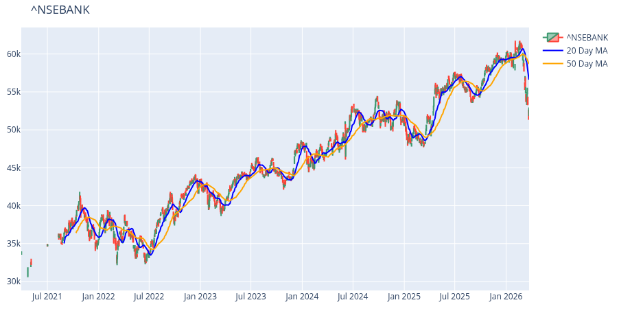

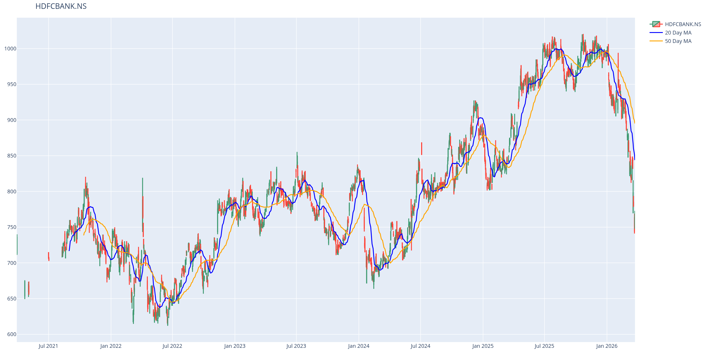

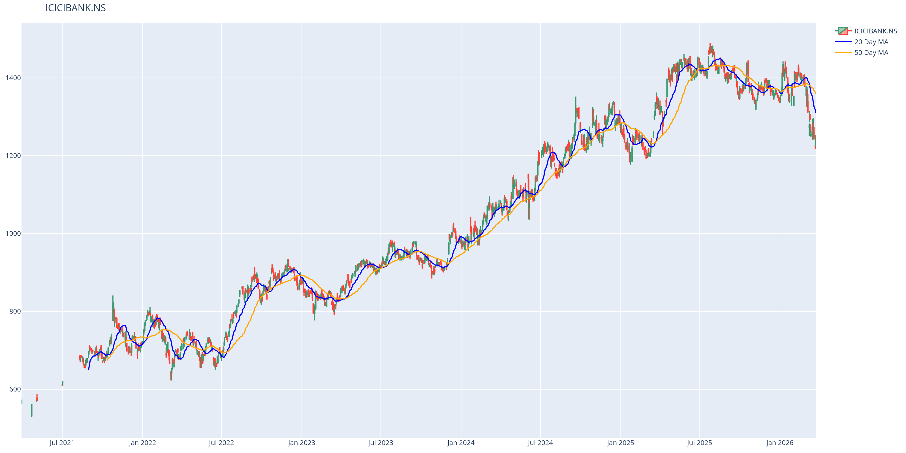

### Video demo

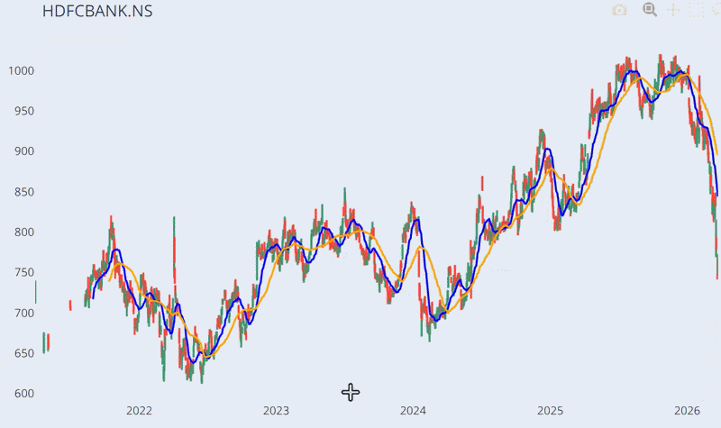

### Insights
- All the stocks have shown strong growth.
- ICICI and BANK NIFTY have experienced less volatility and a smooth bearish trend has been followed.
- HDFC showed more volatility, even though it has also been in an uptrend the drawdowns have been major and the recent data also shows a major drawdown or trend reversal.

## [3 Sensitivity (Beta) of the stocks](3_Sensitivity_(beta).ipynb)

Sensitivity or beta of a stock is how it moves corresponding to the movement of the market and here the market being the index of the sector in which the stock is.

So, simply how much does the stock moves with respect to its sector index.

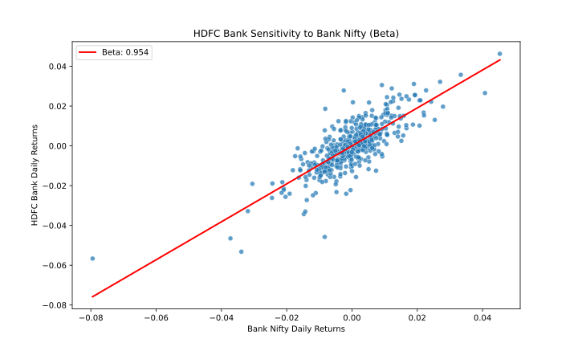

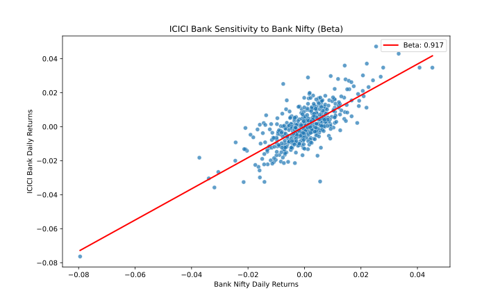

### Insights

- Both HDFC and ICICI have a beta of slightly below 1 so they almost sync up to index and only being slightly less respondent to the movement of the index itself.

## [4 Stock vs Index (Alpha)](4_Stock_vs_Index_(alpha).ipynb)

Alpha is how much better or worse the stock has performed in the market compared to its index.

- I use how 100 Rs investment grows over a period of time as a way to showcase it and compare the various tickers.

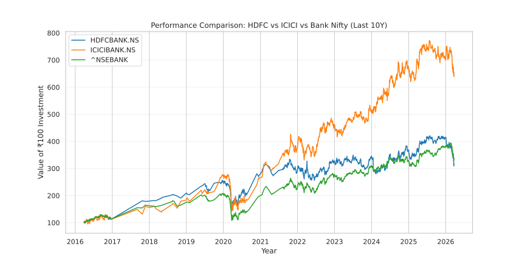

### Insights
- HDFC has been closely matched to BANK NIFTY while outperforming it slightly over certain periods of time.
- ICICI has almost given double the profit you would have made if you invested in the index, while closely matching the index in Covid.

## [5 Sharpe Ratio](5_Sharpe_Ratio.ipynb)

Alpha is how much more profit you are earning compared to say an index or a base line like say a safer instrument (government bonds), whereas sharpe ratio is were there excess volatility to achieve that profit, simply answering "Was the extra profit worth the stress?"

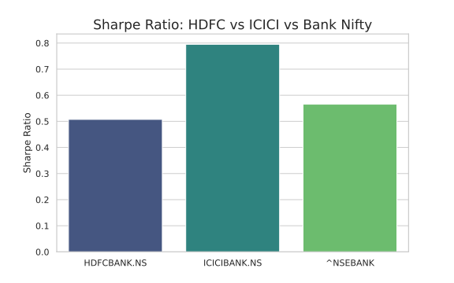

### Insights
- HDFC and BANK NIFTY both have similar shapre ratio which is between 0.5 and 0.6 which means that the extra volatility hasn't been rewarded with enough extra profit.
- ICICI outperforms both meaning ICICI offers best risk-adjusted returns in the market as of now.

## [6 Relative Strength Index (RSI)](6_RSI.ipynb)

RSI is an indicator telling if a stock is overbought (>70) or oversold (<30), indicating whether to expect a drawdown or upward movement.

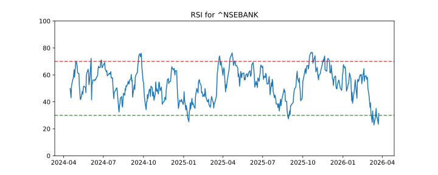

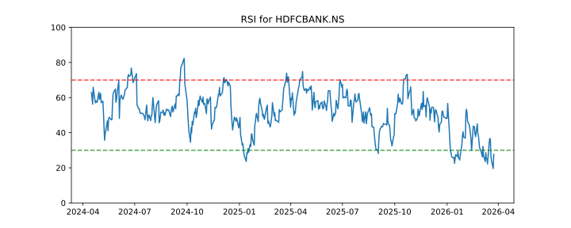

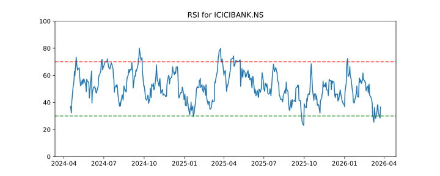

---

## Conclusion

- Based on the above analysis ICICI Bank has outperformed both HDFC Bank and the Bank Nifty index by twice while also having a healthy risk-adjusted return and less volatility.
---
